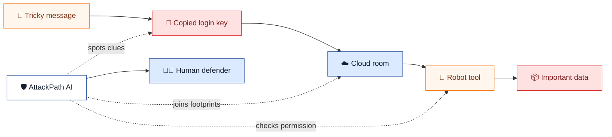
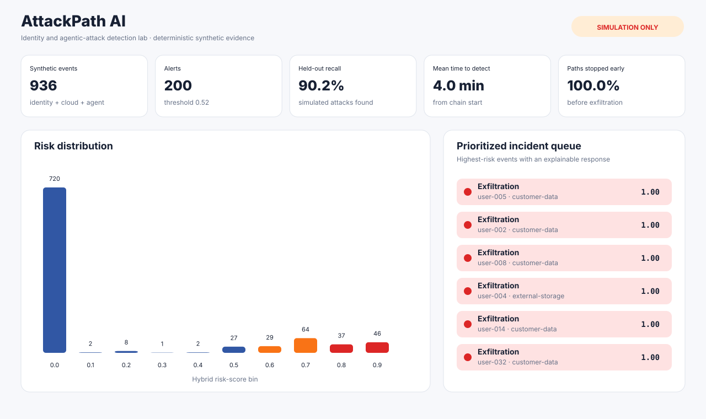
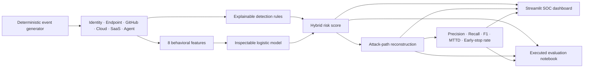

<div align="center">

# 🛡️ AttackPath AI

### Identity & Agentic-Attack Detection Lab

[](https://www.python.org/)
[](app.py)
[](https://attack.mitre.org/)
[](https://genai.owasp.org/)
[](#safety-boundary)

**Simulate → Correlate → Detect → Explain → Contain safely**

[Dashboard](#interactive-dashboard) · [Notebook](notebooks/01_identity_agent_attack_detection.ipynb) · [Evaluation](artifacts/evaluation.json) · [Quick start](#quick-start)

</div>

---

AttackPath AI is a safe cyber range that models how a modern compromise can move across identity, endpoint, GitHub, cloud, SaaS, and AI-agent surfaces. It combines explainable detection rules with a small inspectable ML model, reconstructs multi-stage attack paths, and measures whether defenders find each chain before simulated data exfiltration.

The project is motivated by current evidence: Google Cloud reported that identity issues underpinned initial access in **83% of major cloud and SaaS incidents** in its H1 2026 report, while Anthropic documented AI being used to chain reconnaissance, exploitation, credential theft, and lateral movement. See [Google Cloud Threat Horizons H1 2026](https://cloud.google.com/security/report/resources/cloud-threat-horizons-report-h1-2026) and [Anthropic's AI-enabled cyber-threat mapping](https://www.anthropic.com/research/attack-navigator).

## Explain it like I'm 5

Imagine a thief gets a copied key, walks through several rooms, and asks a robot helper to open the final safe.

AttackPath AI is the security team watching the whole journey. It notices that the key is being used strangely, connects the footprints between rooms, checks what the robot was asked to do, and tells a human where to stop the thief.



## Interactive dashboard

[](app.py)

The Streamlit dashboard answers four SOC questions:

1. How many events cross the current alert threshold?
2. Which attack paths were detected before exfiltration?
3. Which identities, assets, and agent tools need investigation first?
4. Which rules and ML features influenced each alert?

It includes global threshold, scenario, and severity controls; five headline metrics; a hybrid-score distribution; attack-chain drill-down; a bounded incident queue; JSONL export; and a model/safety card.

## What is simulated

| Scenario | Defensive question | Key mappings |
| --- | --- | --- |
| Device-code phishing | Can identity and SaaS signals expose token replay before bulk download? | MITRE T1566, T1528, T1098, T1567 |
| Infostealer → cloud pivot | Can endpoint, GitHub, OIDC, and cloud activity be joined into one path? | MITRE T1555, T1539, T1550, T1530 |
| Prompt injection → tool abuse | Can defenders distinguish retrieval from risky tool chaining and privileged action? | OWASP ASI01, ASI02, ASI03, ASI05 |

Each attack chain has six ordered stages. Normal activity is interleaved to provide a benign behavioral baseline.

## Architecture



## Measured synthetic replay

The checked-in [evaluation report](artifacts/evaluation.json) comes from a deterministic build with threshold `0.52`.

| Measure | Result |
| --- | ---: |
| Total synthetic events | 936 |
| Complete attack paths | 36 |
| Held-out precision | **100.0%** |
| Held-out recall | **90.2%** |
| Held-out F1 | **94.8%** |
| Mean time to detect | **4.0 minutes** |
| Paths detected before exfiltration | **100.0%** |

These results demonstrate reproducibility on a deliberately learnable synthetic fixture. They do **not** estimate production false-positive rates, attacker success, employee risk, or detection effectiveness on real telemetry.

## Quick start

From the repository root:

```bash
PYTHONPATH=attackpath-ai python -m attackpath_ai.cli self-test
python attackpath-ai/build_notebook.py
streamlit run attackpath-ai/app.py
```

Run the CLI from the project directory or set `PYTHONPATH=attackpath-ai`:

```bash
cd attackpath-ai

python -m attackpath_ai.cli generate --output data/synthetic_events.csv
python -m attackpath_ai.cli analyze --output artifacts/evaluation.json
python -m attackpath_ai.cli self-test
```

## Notebook

Open [Identity & Agentic-Attack Detection Lab](notebooks/01_identity_agent_attack_detection.ipynb) for the full reviewable analysis:

- bounded telemetry preview and explicit assumptions;
- held-out precision, recall, F1, and confusion matrix;
- benign-versus-attack score distribution;
- visual attack-chain reconstruction;
- model feature influence and highest-risk alerts;
- reproducibility, safety, and pre-exfiltration release gates.

The notebook is generated and executed from `build_notebook.py`. It uses only the Python standard library and this project's source code, keeping its analysis reproducible in an offline environment.

## Detection design

The rule layer looks for interpretable behaviors such as:

- untrusted foreign sessions and weak-MFA token replay;
- credential or secret access;
- federated OIDC role abuse and privilege escalation;
- high-risk AI-agent tool calls;
- bulk data movement and probable exfiltration.

The ML layer is a dependency-free logistic classifier trained on eight normalized features. Its probability is blended with the rule score. Every alert retains its rule hits, MITRE/OWASP mappings, affected identity and asset, severity, and a human-review recommendation.

## Safety boundary

This repository contains **defensive simulation code only**:

- no real identities, email addresses, tokens, credentials, or customer data;
- no phishing delivery, malware, persistence, exploitation, or password collection;
- no cloud, GitHub, SaaS, endpoint, or AI-provider connection;
- no autonomous account suspension or destructive response;
- no claim that synthetic benchmark results transfer to production.

Use only privacy-reviewed, authorized telemetry. Require human approval for containment, calibrate thresholds against analyst capacity, and test for drift and subgroup impact before production use.

## Project map

```text
attackpath-ai/
├── app.py
├── attackpath_ai/
│   ├── core.py
│   ├── visuals.py
│   └── cli.py
├── notebooks/01_identity_agent_attack_detection.ipynb
├── data/synthetic_events.csv
├── artifacts/evaluation.json
├── assets/
│   ├── dashboard-preview.svg
│   └── risk-distribution.svg
├── tests/test_attackpath.py
├── build_notebook.py
└── validate_project.py
```

## Verification

```bash
python -m unittest discover -s attackpath-ai/tests -v
python attackpath-ai/build_notebook.py
python attackpath-ai/validate_project.py
```

GitHub Actions additionally smoke-tests the default Streamlit page, all five metric cards, and all four dashboard tabs.
