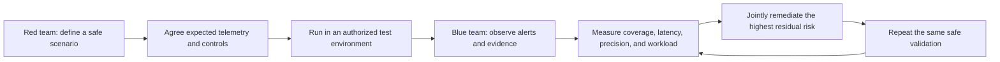

# Red Team, Blue Team & Purple Team Analytics

Five reproducible notebooks for safe adversary-emulation planning, control validation, detection engineering, incident response, and joint red/blue learning. Every project is deterministic, offline, and based on synthetic non-sensitive data.

## Projects

| # | Track | Notebook | Decision focus | Visual / ML extension |
| ---: | --- | --- | --- | --- |
| 01 | Red team | [Attack-path emulation planning](notebooks/01_red_team_attack_path_emulation_planning.ipynb) | Which authorized scenarios maximize learning value within alert and operator constraints? | Tactic-priority view, workload/value map, logistic vs random forest, feature importance |
| 02 | Red team | [Social-engineering control evaluation](notebooks/02_red_team_social_engineering_control_evaluation.ipynb) | Which defensive layers and reporting paths need improvement? | Channel outcomes, signal heatmap, held-out bypass models, global drivers |
| 03 | Blue team | [Detection threshold tuning](notebooks/03_blue_team_detection_threshold_tuning.ipynb) | Which threshold captures the most incidents within analyst capacity? | Precision–recall, workload frontier, model benchmark, feature importance |
| 04 | Blue team | [Incident correlation](notebooks/04_blue_team_incident_correlation.ipynb) | Which isolated alerts belong in a single investigation? | Incident timeline, source/phase heatmap, held-out models, correlation drivers |
| 05 | Purple team | [Detection validation](notebooks/05_purple_team_detection_validation.ipynb) | Where is residual detection risk highest after an authorized exercise? | Coverage matrix, calibration, model benchmark, remediation ranking |

## Learning loop



## Safety and ethics

- No payloads, exploit code, credential collection, delivery infrastructure, evasion recipes, or instructions for targeting real systems.
- The social-engineering project evaluates synthetic metadata and defensive controls; it does not generate deceptive messages.
- Real exercises require written authorization, rules of engagement, approved systems, protected participants, rollback plans, and evidence-retention rules.
- Synthetic metrics demonstrate analytical methods. They do not establish production detection effectiveness.
- ML outputs support human triage and detection engineering; they do not authorize containment or disciplinary action.

## Run and validate

From the repository root:

```bash
python purple-team/build_notebooks.py
python purple-team/validate_notebooks.py
```

The validator checks notebook structure and safety language, executes every cell, embeds Matplotlib figures for GitHub preview, and fails on any broken assertion.
